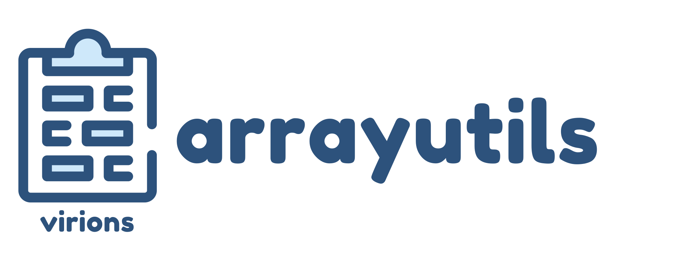

  
     
  <h1></h1>   

    
    
     
    
    
    
  
  <h1><strong> Library that provides a method to fancy manipulate an array </strong></h1>   

  

## :clipboard: Table of Contents  
- [:book: Introduction](#book-introduction)  
- [:package: Downloads](#package-downloads)  
- [:memo: License](#memo-license)  
  
   
  
## :book: Introduction  
The ~~evil~~ PHP array functions give developers the pain of:

* Some functions **requires array first**, but some functions **require array last**...  
* Some functions **returns result**, but some functions **modify referenced variables**...
* Code was **line-break** because since it is a function...
* Each function has **different parameters to the callback function**...
* No modern functions using arrays. Such as `every`, `some`

I created this library to solve these problems and make code flow like `js-array`

For a detailed description, [Click here (GitBook)](https://arrayutils.docs.present.kim/)
  
   
  
## :package: Downloads:  
#### 1. Modern PHP developer
You can use this library with composer.  
- Go to [**Packagist**](https://packagist.org/packages/presentkim/arrayutils)  

#### 2. PMMP plguin developer
You can use this library with poggit.  
- Go to [**Poggit**](https://poggit.pmmp.io/ci/presentkim-pm/arrayutils/~)   
  
   
  
## :memo: License  
> You can check out the full license [here](LICENSE)  
  
This project is licensed under the terms of the **MIT** license  